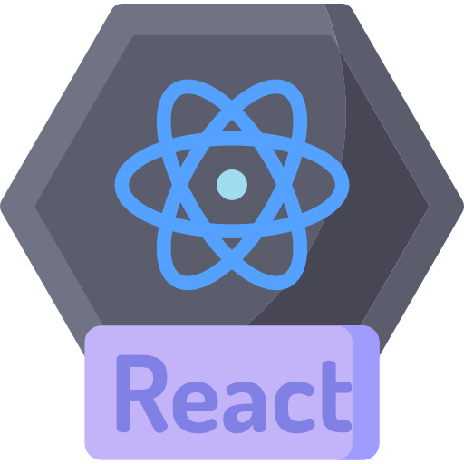

   <h1>Hi there, I'm Mikołaj </h1>

  

  
  &#8287;&#8287;&#8287;&#8287;&#8287;
  
  &#8287;&#8287;&#8287;&#8287;&#8287;
  
  &#8287;&#8287;&#8287;&#8287;&#8287;

**About me**

- 👨‍💻 Frontend React Engineer

- 👨‍🎓 Bachelor's degree, Jagiellonian University in Cracow

- ❤️ I love creating interactive applications using React

- 💪 In my free time, I love training at the gym and play computer games 🎮
  
- 🐸 I love Pepe the Frog

**TechStack**

      
  
  
  
  
  
  
  
  
  
  
  

**I am currently learning**

  
    

  

  
